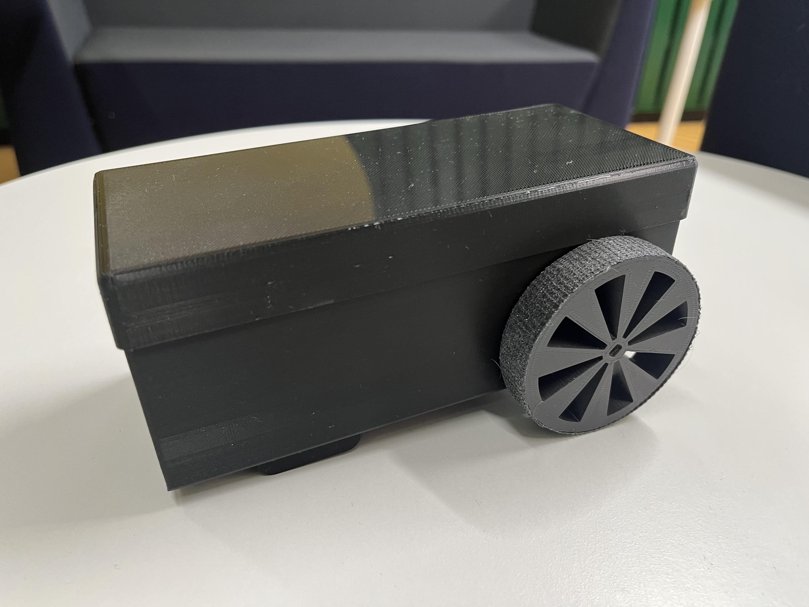

# LineFollowerRobot
Group project for course Principles of digital fabrication at the university of Oulu. 

## Description
A simple robot that is designed to follow a black line on the ground. It uses arduino and compatible components control the movement.

## Materials
The shell is made of 3D-printed plastic

**The list of components:**

Arduino Uno

Arduino  Cables

Breadboard

2x Brushed DC motor 

Battery holder

2x Line tracking sensor 

H Bridge

## Authors and acknowledgment
3D-modelling and manufactoring: **Atte Kiviniemi**

Programming: **Jaakko Ojala**

Component connections: **Verneri Niinimäki**

Testing was done together
